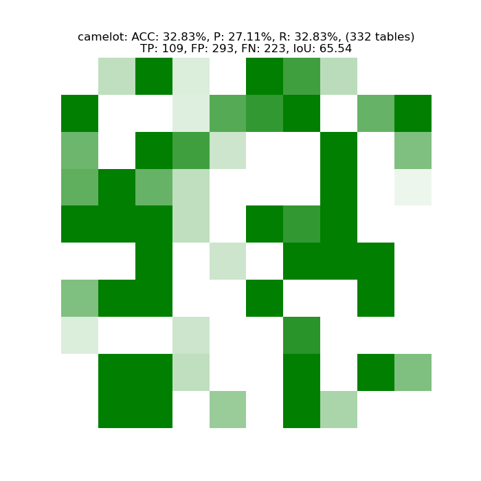
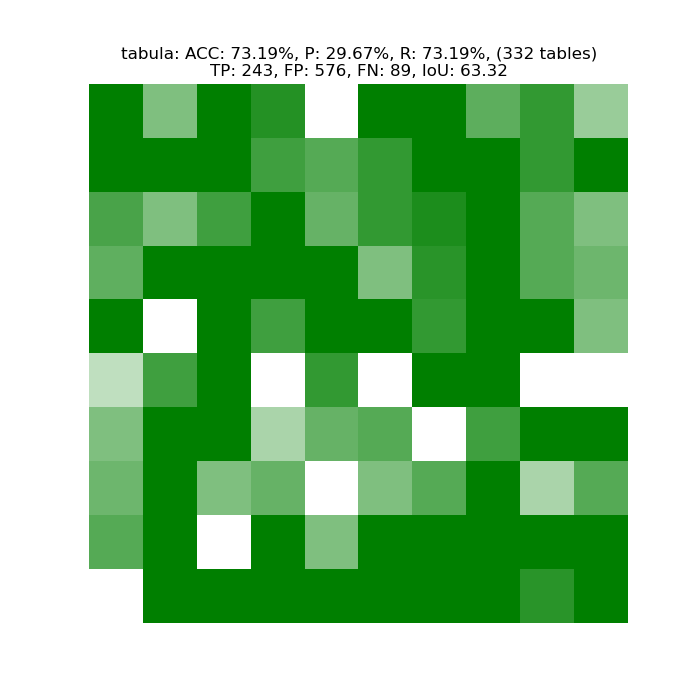
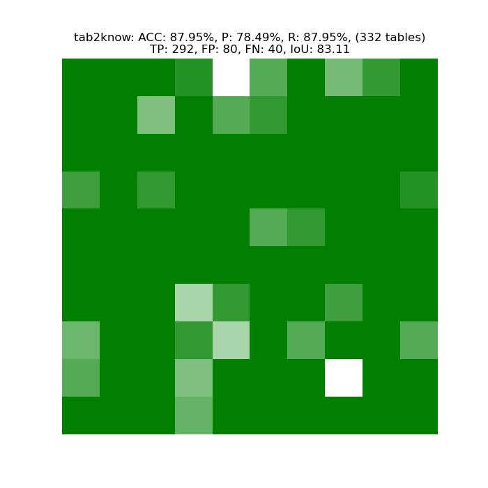

# pdf2info

Pdf2info is a simple table extractor library using tabula.

## Installation

Choose one of following:

### Local
Using local python3 interpreter:
```console
$ python3 -m pip install -r requirements
```

### Virtualenv
Creating a new virtual environment:

Assuming ```$ python3 -m pip install virtualenv``` :

```console
$ python3 -m pip install virtualenv
$ virtualenv venv
$ source venv/bin/activate
(venv) $ python3 -m pip install -r requirements.txt
```

### Conda
Creating a conda environment (assumg you have conda/miniconda installed) :
```console
$ conda create --name venv --file requirements.txt
```


## How to use

### Launch extraction

Place all your necessary PDFs in a single dicrectory, then call process_folder.py script:

```console
$ python tables_from_dir.py --dir=path/to/your/dir --out=path/to/out/folder
```

This will create one csv file per table.

Logging can be read in **results.log** file. If need to check console live log, add **--log-console** param:

```console
$ python tables_from_dir.py --dir=path/to/your/dir --out=path/to/out/folder --log-console
```

If you only need to extract from one pdf, use `tables_from_file.py` instead of `tables_from_dir.py` 

### Recreate tab2know results

Check [analysis/tab2know_tests](analysis/tab2know_tests) istructions.

### Recreate pdf2info results

Check [analysis/pdf2info_tests](analysis/pdf2info_tests) istructions.

# Comparison

<p align="center">
  
  
  
  
</p>